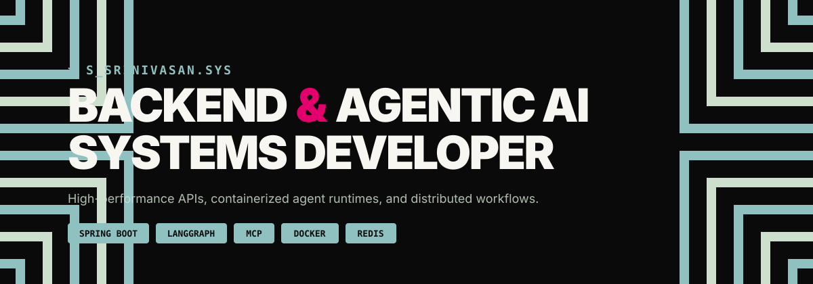

<!-- S. SRINIVASAN — profile. Visual system lives in assets/profile.svg -->

---

### ↗ INDEX

**Contact** · [Email](mailto:srinivasansubr2006@gmail.com) · [LinkedIn](https://www.linkedin.com/in/s-srinivasan-a69006315/) · [GitHub](https://github.com/S-Srinivasan-06) · [Portfolio](https://profile-srinivasan.vercel.app/) · [LeetCode](https://leetcode.com/u/aKpXSchpeo/) · [Résumé](https://drive.google.com/drive/folders/1IWd5JfZFECu4wwFAG0Z6pXdJ_T-_xXtO)

**Projects** · [Taskflow](https://github.com/S-Srinivasan-06/Taskflow) · [Sandman](https://github.com/S-Srinivasan-06/sandman-ai-sandbox)

**Recognition** · [WorldQuant BRAIN — Gold Tier](https://drive.google.com/file/d/1zIBtgQzatXbO6SBdoIhzWHjmnBexFLPH/view) · [IQC 2026 — Top 20% Global](https://drive.google.com/file/d/1D-_3CvzR5S7TizVrOdNl_y-qULx4_AOn/view) · [AMD Slingshot '26](https://certificate.hack2skill.com/verify/2026H2SAMDKKT-P00024) · [LangChain Academy](https://academy.langchain.com/certificates/bgp8dxfxlp) · [Anthropic — MCP Advanced](https://verify.skilljar.com/c/yyaud8ryjyeq) · [Anthropic — MCP Intro](https://verify.skilljar.com/c/hme7x2v5p2so) · [AWS Academy](https://www.credly.com/go/A0lEuiOv)

Full experience → <a href="https://profile-srinivasan.vercel.app/">profile-srinivasan.vercel.app</a>

