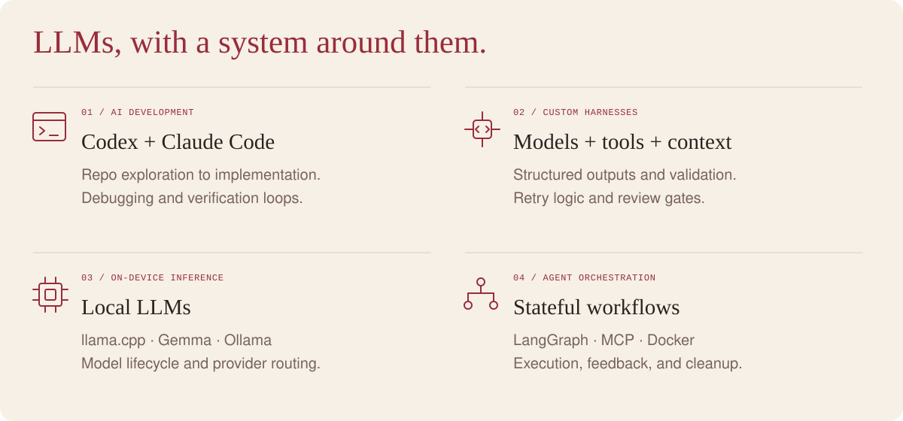
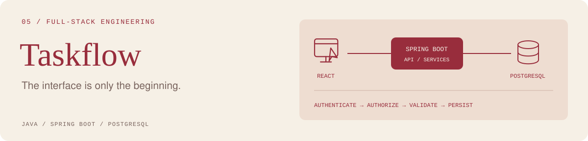
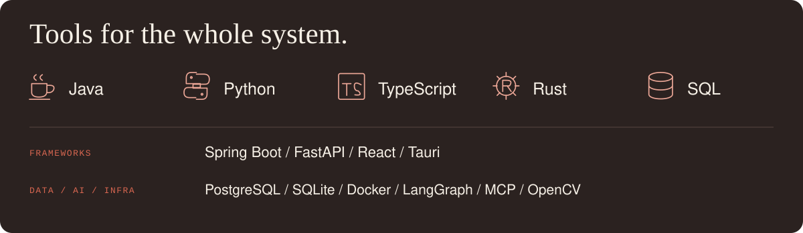
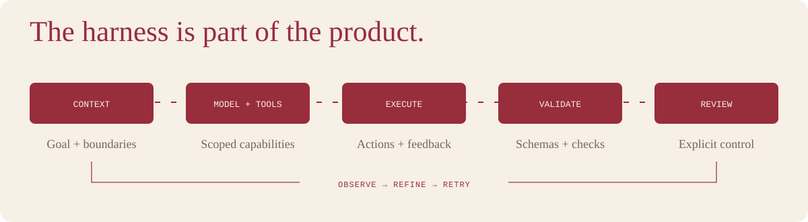
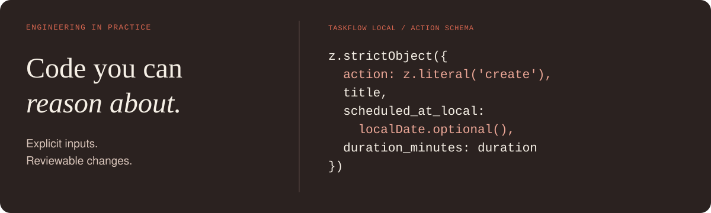
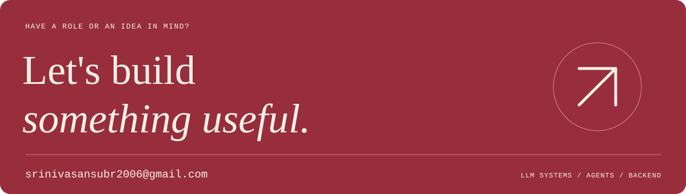

<picture>
  <source media="(max-width: 600px)" srcset="./assets/hero-mobile.svg" />
  
</picture>

# LLMs, tools, and the systems between them.

I'm **Srinivasan**, a Computer Science undergraduate at **KIIT (2024–2028)**. I work with **Codex and Claude Code**, build **custom LLM harnesses**, and connect **local models, tools, and multi-step agents** to real products.

My foundation is **Java and Python backends, TypeScript interfaces, and Rust desktop integration**. I care about what happens around a model: the context it receives, the tools it can use, the checks around its output, and the experience it creates.

**[Explore my work](#selected-work)** &nbsp; / &nbsp; **[Read my code](#engineering-in-practice)** &nbsp; / &nbsp; **[LinkedIn](https://www.linkedin.com/in/s-srinivasan-a69006315/)** &nbsp; / &nbsp; **[Email me](mailto:srinivasansubr2006@gmail.com)**

 

## LLMs & agent engineering

<picture>
  <source media="(max-width: 600px)" srcset="./assets/agents-mobile.svg" />
  
</picture>

**AI-assisted development:** I use **Codex and Claude Code** for repository exploration, planning, implementation, debugging, and verification. I treat context, task scope, tool access, and feedback loops as part of the engineering work.

**Building the agent system:** I connect models to **bounded context, structured outputs, tool registries, execution loops, retries, and human review**. My projects include **on-device inference**, **model lifecycle management**, **provider routing**, and **stateful orchestration**.

[Local inference & harness code ↗](https://github.com/S-Srinivasan-06/Taskflow-Local-hacktoberfest-weekend/blob/main/src/model/modelService.ts) &nbsp; · &nbsp; [Agent graph ↗](https://github.com/S-Srinivasan-06/sandman-ai-sandbox/blob/main/src/core/graph.py) &nbsp; · &nbsp; [Model routing ↗](https://github.com/S-Srinivasan-06/sandman-ai-sandbox/blob/main/src/infrastructure/models.py)

 

## Selected work

Desktop software, backend systems, and AI tools — with the implementation open to explore.

### 01 / Taskflow Local

**A desktop workspace that keeps tasks and inference on your machine.** Natural-language and screenshot input become reviewable task changes, with reminders and a system tray for daily use.

**Engineering highlights:** on-device Gemma through llama.cpp, a custom inference harness, schema-validated actions, approval before changes, and Rust-managed model lifecycle.

`Tauri 2` `Rust` `React` `TypeScript` `SQLite` `llama.cpp`

**[View source ↗](https://github.com/S-Srinivasan-06/Taskflow-Local-hacktoberfest-weekend)** &nbsp; · &nbsp; [Windows download ↗](https://github.com/S-Srinivasan-06/Taskflow-Local-hacktoberfest-weekend/releases/latest) &nbsp; · &nbsp; [Interface preview ↗](https://github.com/S-Srinivasan-06/Taskflow-Local-hacktoberfest-weekend/blob/main/docs/screenshots/forest-2026-10-05.png)

 

### 02 / Financial Reconciliation Agent

**A workbench for connecting financial records.** A staged pipeline combines fee-aware matching, exception review, and double-entry journal exports through a web console and CLI.

**Engineering highlights:** resumable pipeline state, multitable matching, WebSocket telemetry, and a durable SHA-256 audit chain.

`Python` `FastAPI` `Pandas` `Pydantic` `WebSockets` `Docker`

**[View source ↗](https://github.com/S-Srinivasan-06/Razorpay-Buildathon-webui-and-cli)** &nbsp; · &nbsp; [Read the pipeline ↗](https://github.com/S-Srinivasan-06/Razorpay-Buildathon-webui-and-cli/blob/main/src/app/pipeline.py)

 

### 03 / CrowdShield

**A computer vision dashboard for understanding crowd movement.** Detection and tracking feed density and pressure visualizations, with editable regions of interest and archived runs.

**Engineering highlights:** predictive centroid tracking, cached Gaussian KDE, threaded sessions, SSE telemetry, and MJPEG streaming.

`Python` `OpenCV` `YOLOv8` `OpenVINO` `NumPy` `JavaScript`

**[View source ↗](https://github.com/S-Srinivasan-06/CrowdShield)** &nbsp; · &nbsp; [Read the tracking engine ↗](https://github.com/S-Srinivasan-06/CrowdShield/blob/main/src/features.py)

 

### 04 / Sandman

**An AI coding agent with a workspace and an execution loop.** It writes, runs, and retries code inside Docker workspaces, then packages the output for use outside the session.

**Engineering highlights:** LangGraph orchestration, MCP tools, execution and cleanup paths, Docker resource controls, and routing across local and hosted model providers.

`Python` `LangGraph` `LangChain` `MCP` `Docker` `Ollama`

**[View source ↗](https://github.com/S-Srinivasan-06/sandman-ai-sandbox)** &nbsp; · &nbsp; [Read the agent graph ↗](https://github.com/S-Srinivasan-06/sandman-ai-sandbox/blob/main/src/core/graph.py)

 

### 05 / Taskflow

**A task workspace for the web.** Calendars, timezone-aware scheduling, and instant status updates connect a React interface to a Spring Boot and PostgreSQL backend.

**Engineering highlights:** ownership checks, optimistic concurrency, an isolated offline read cache, and Testcontainers integration tests.

`Java` `Spring Boot` `React` `TypeScript` `PostgreSQL` `Docker`

**[View source ↗](https://github.com/S-Srinivasan-06/Taskflow)** &nbsp; · &nbsp; [Read the integration tests ↗](https://github.com/S-Srinivasan-06/Taskflow/blob/main/src/test/java/com/taskflow/security/AuthOwnershipIntegrationTest.java)

 

## Working stack

<picture>
  <source media="(max-width: 600px)" srcset="./assets/toolkit-mobile.svg" />
  
</picture>

My main languages are **Java, Python, TypeScript, Rust, and SQL**. I use **Spring Boot and FastAPI** for services, **React and Tauri** for products, and **LangGraph, MCP, and Docker** for agent workflows.

 

## Engineering in practice

<picture>
  <source media="(max-width: 600px)" srcset="./assets/harness-mobile.svg" />
  
</picture>

A capable model is one part of the system. The harness also needs **clear state, scoped tools, useful feedback, and explicit control over mutations**. These are the boundaries I work on in Taskflow Local and Sandman.

<picture>
  <source media="(max-width: 600px)" srcset="./assets/code-mobile.svg" />
  
</picture>

| Engineering decision | Implementation to explore |
| --- | --- |
| **Validate before changing state** | [Strict Zod action schemas](https://github.com/S-Srinivasan-06/Taskflow-Local-hacktoberfest-weekend/blob/main/src/model/actionSchema.ts) constrain model-generated task operations. |
| **Make ownership explicit** | [Task service](https://github.com/S-Srinivasan-06/Taskflow/blob/main/src/main/java/com/taskflow/service/TaskService.java) scopes operations to users and checks versions before mutations. |
| **Test the boundaries** | [Integration tests](https://github.com/S-Srinivasan-06/Taskflow/blob/main/src/test/java/com/taskflow/security/AuthOwnershipIntegrationTest.java) exercise isolation, CSRF, session revocation, and conflicting updates. |
| **Leave an inspectable trail** | [Append-only audit ledger](https://github.com/S-Srinivasan-06/Razorpay-Buildathon-webui-and-cli/blob/main/src/app/core/audit.py) chains records with SHA-256 hashes and persists them to disk. |

 

## Beyond the code

I enjoy the space where **engineering rigor meets product craft**: a clear data model, a predictable workflow, and an interface that helps someone get things done. Alongside my Computer Science degree, I work on quantitative research as a **WorldQuant BRAIN Gold Tier Consultant**.

[More repositories ↗](https://github.com/S-Srinivasan-06?tab=repositories) &nbsp; · &nbsp; [LeetCode ↗](https://leetcode.com/u/aKpXSchpeo/)

 

**[Get in touch ↗](mailto:srinivasansubr2006@gmail.com)** &nbsp; · &nbsp; [Connect on LinkedIn ↗](https://www.linkedin.com/in/s-srinivasan-a69006315/)
