<picture>
  <source media="(max-width: 600px)" srcset="./assets/v4-hero-mobile.svg" />
  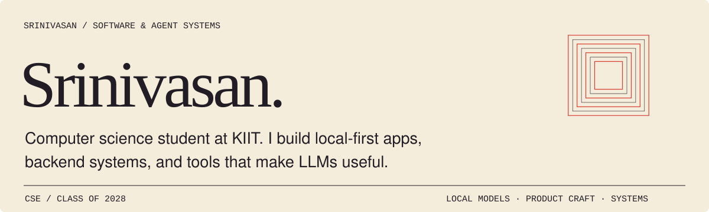
</picture>

<picture>
  <source media="(max-width: 600px)" srcset="./assets/v4-about-mobile.svg" />
  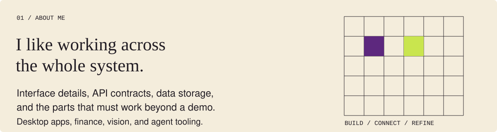
</picture>

<picture>
  <source media="(max-width: 600px)" srcset="./assets/v4-agents-mobile.svg" />
  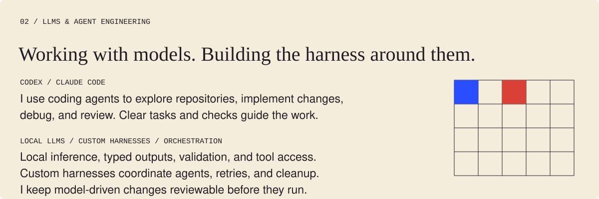
</picture>

<picture>
  <source media="(max-width: 600px)" srcset="./assets/v4-process-mobile.svg" />
  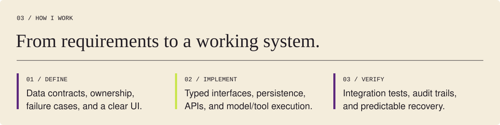
</picture>

<picture>
  <source media="(max-width: 600px)" srcset="./assets/v4-range-mobile.svg" />
  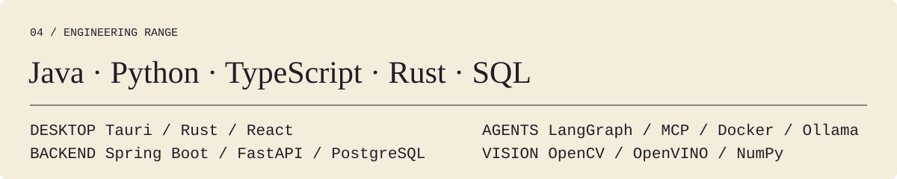
</picture>

<a href="https://github.com/S-Srinivasan-06/Taskflow-Local-hacktoberfest-weekend">
<picture>
  <source media="(max-width: 600px)" srcset="./assets/v4-taskflow-local-mobile.svg" />
  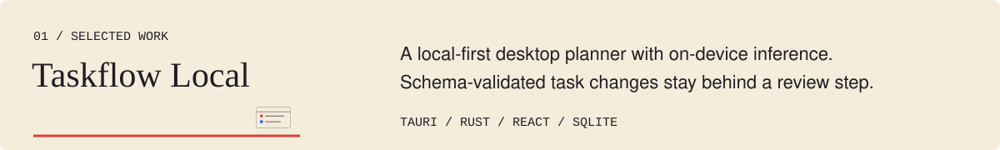
</picture>
</a>

<picture>
  <source media="(max-width: 600px)" srcset="./assets/v4-interlude-1-mobile.svg" />
  
</picture>

<a href="https://github.com/S-Srinivasan-06/Razorpay-Buildathon-webui-and-cli">
<picture>
  <source media="(max-width: 600px)" srcset="./assets/v4-reconciliation-mobile.svg" />
  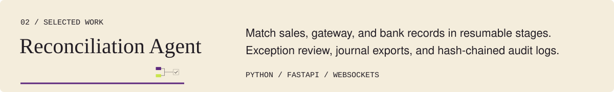
</picture>
</a>

<picture>
  <source media="(max-width: 600px)" srcset="./assets/v4-interlude-2-mobile.svg" />
  
</picture>

<a href="https://github.com/S-Srinivasan-06/CrowdShield">
<picture>
  <source media="(max-width: 600px)" srcset="./assets/v4-crowdshield-mobile.svg" />
  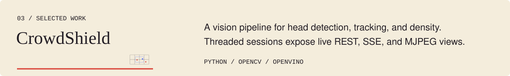
</picture>
</a>

<picture>
  <source media="(max-width: 600px)" srcset="./assets/v4-interlude-3-mobile.svg" />
  
</picture>

<a href="https://github.com/S-Srinivasan-06/sandman-ai-sandbox">
<picture>
  <source media="(max-width: 600px)" srcset="./assets/v4-sandman-mobile.svg" />
  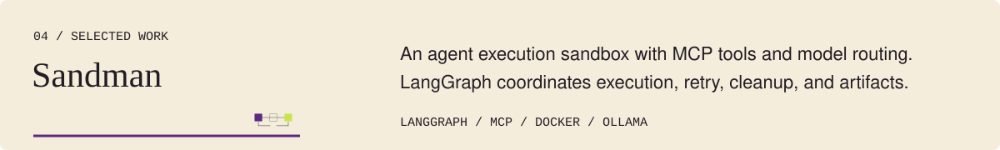
</picture>
</a>

<picture>
  <source media="(max-width: 600px)" srcset="./assets/v4-interlude-4-mobile.svg" />
  
</picture>

<a href="https://github.com/S-Srinivasan-06/Taskflow">
<picture>
  <source media="(max-width: 600px)" srcset="./assets/v4-taskflow-mobile.svg" />
  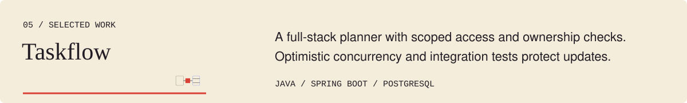
</picture>
</a>

<a href="mailto:srinivasansubr2006@gmail.com">
<picture>
  <source media="(max-width: 600px)" srcset="./assets/v4-contact-mobile.svg" />
  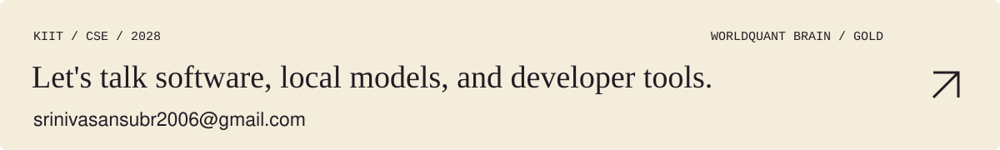
</picture>
</a>

