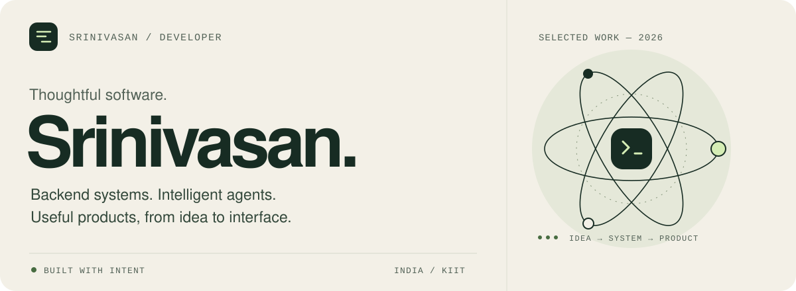
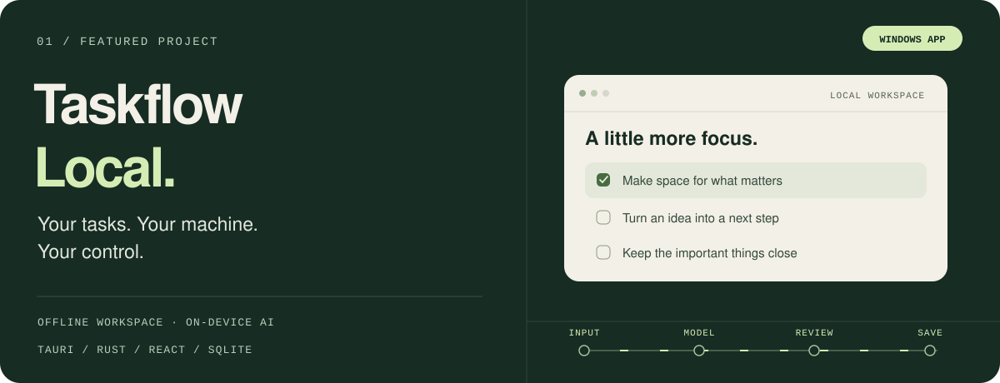
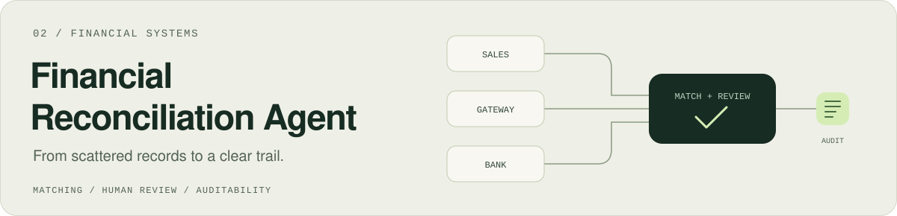
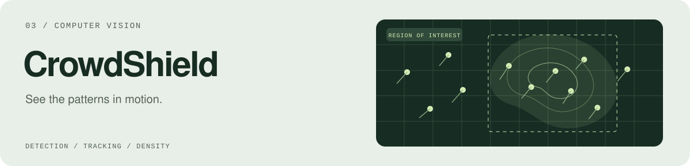
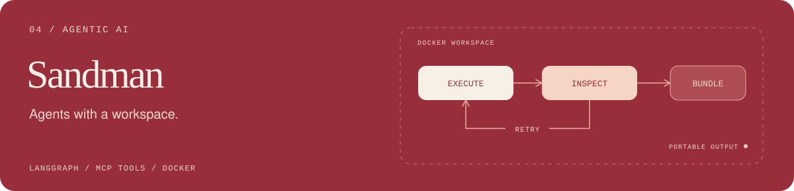

BACKEND · AGENTIC AI · PRODUCT ENGINEERING

  

# Hi, I'm Srinivasan.

I build software that makes complex work feel simple — from local desktop tools to backend systems and AI agents.

[Selected work](#selected-work) &nbsp; / &nbsp; [About](#a-little-about-me) &nbsp; / &nbsp; [LinkedIn](https://www.linkedin.com/in/s-srinivasan-a69006315/) &nbsp; / &nbsp; [Get in touch](mailto:srinivasansubr2006@gmail.com)

 

## Selected work

A few projects that show how I think, build, and connect the pieces.

### 01 / Taskflow Local

**Your tasks. Your machine. Your control.** An offline Windows task manager that turns language and screenshot input into reviewable task changes. Desktop reminders, a system tray, and on-device Gemma inference bring it together.

`Tauri 2` `Rust` `React` `TypeScript` `SQLite` `llama.cpp`

[Explore the project ↗](https://github.com/S-Srinivasan-06/Taskflow-Local-hacktoberfest-weekend) &nbsp; · &nbsp; [Download for Windows ↗](https://github.com/S-Srinivasan-06/Taskflow-Local-hacktoberfest-weekend/releases/latest) &nbsp; · &nbsp; [See the interface ↗](https://github.com/S-Srinivasan-06/Taskflow-Local-hacktoberfest-weekend/blob/main/docs/screenshots/forest-2026-10-05.png)

 

### 02 / Financial Reconciliation Agent

A reconciliation workbench that connects sales, gateway ledgers, and bank statements. Fee-aware matching, exception review, double-entry journal exports, and SHA-256 audit trails are available through a live web console and CLI.

`Python` `FastAPI` `Pandas` `Pydantic` `WebSockets` `Docker`

[Explore the project ↗](https://github.com/S-Srinivasan-06/Razorpay-Buildathon-webui-and-cli) &nbsp; · &nbsp; [Inside the pipeline ↗](https://github.com/S-Srinivasan-06/Razorpay-Buildathon-webui-and-cli/blob/main/src/app/pipeline.py)

 

### 03 / CrowdShield

A computer vision dashboard for live crowd analysis. Head detection, motion tracking, and density and pressure visualizations connect to editable regions of interest and archived runs.

`Python` `OpenCV` `YOLOv8` `OpenVINO` `NumPy` `JavaScript`

[Explore the project ↗](https://github.com/S-Srinivasan-06/CrowdShield) &nbsp; · &nbsp; [Inside the tracking engine ↗](https://github.com/S-Srinivasan-06/CrowdShield/blob/main/src/features.py)

 

### 04 / Sandman

An AI coding agent that writes, runs, and retries code inside isolated Docker workspaces. LangGraph orchestration and MCP tools handle execution, file management, testing, and portable output bundles.

`Python` `LangGraph` `LangChain` `MCP` `Docker`

[Explore the project ↗](https://github.com/S-Srinivasan-06/sandman-ai-sandbox) &nbsp; · &nbsp; [Inside the agent graph ↗](https://github.com/S-Srinivasan-06/sandman-ai-sandbox/blob/main/src/core/graph.py)

 

### 05 / Taskflow

**A task workspace for the web.** Calendars, timezone-aware scheduling, and instant status updates, backed by scoped sessions, ownership checks, optimistic concurrency, and an opt-in offline read cache.

`Java` `Spring Boot` `React` `TypeScript` `PostgreSQL` `Docker`

[Explore the project ↗](https://github.com/S-Srinivasan-06/Taskflow)

 

## A little about me

I'm a Computer Science undergraduate at **KIIT, Bhubaneswar (2024–2028)**, focused on backend architecture and agentic AI systems. I like working across the whole product: the data model, the behavior, and the details people actually use.

My core toolkit is **Java, Spring Boot, Python, React, TypeScript, and Docker**. I also work on quantitative research as a **WorldQuant BRAIN Gold Tier Consultant**.

[More repositories ↗](https://github.com/S-Srinivasan-06?tab=repositories) &nbsp; · &nbsp; [LeetCode ↗](https://leetcode.com/u/aKpXSchpeo/)

---

### Have something in mind?

I'm happy to talk about useful tools, thoughtful interfaces, and interesting systems.

**[Let's connect ↗](mailto:srinivasansubr2006@gmail.com)** &nbsp; · &nbsp; [LinkedIn](https://www.linkedin.com/in/s-srinivasan-a69006315/)

Built with curiosity. Refined with care.

