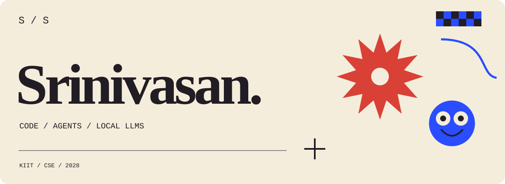
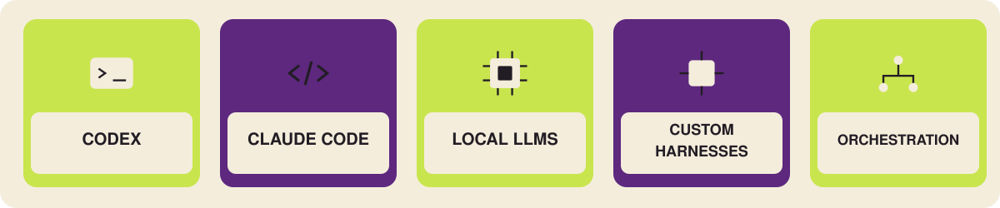
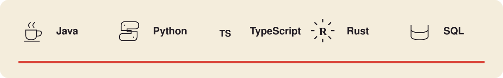
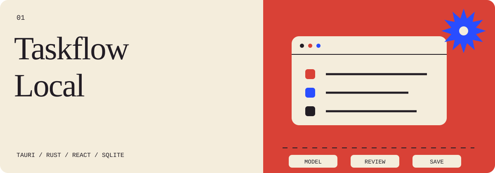
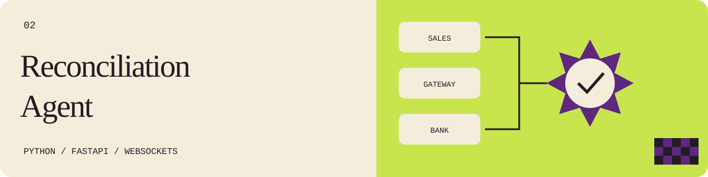
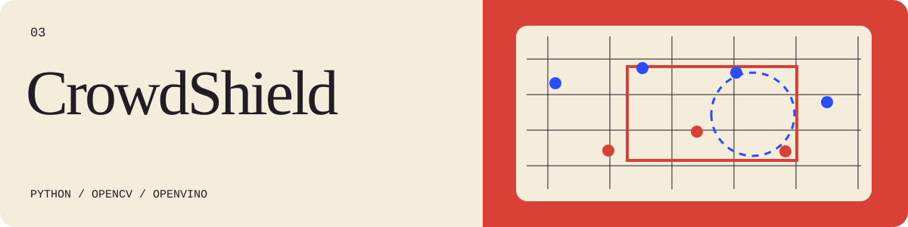
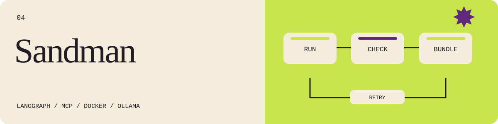
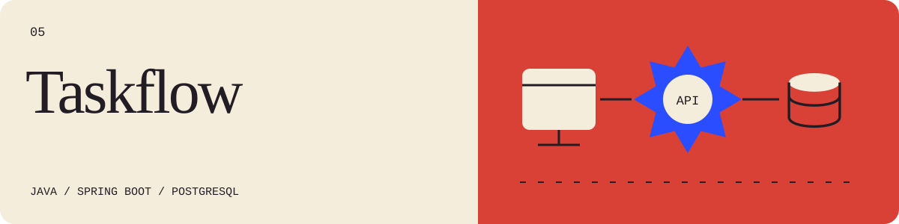
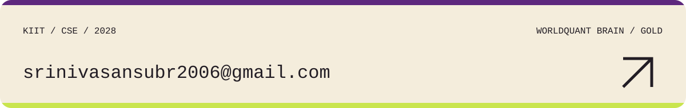

<picture>
  <source media="(max-width: 600px)" srcset="./assets/v3-hero-mobile.svg" />
  
</picture>

<picture>
  <source media="(max-width: 600px)" srcset="./assets/v3-lab-mobile.svg" />
  
</picture>

<picture>
  <source media="(max-width: 600px)" srcset="./assets/v3-stack-mobile.svg" />
  
</picture>

<a href="https://github.com/S-Srinivasan-06/Taskflow-Local-hacktoberfest-weekend">
<picture>
  <source media="(max-width: 600px)" srcset="./assets/v3-taskflow-local-mobile.svg" />
  
</picture>
</a>

<a href="https://github.com/S-Srinivasan-06/Razorpay-Buildathon-webui-and-cli">
<picture>
  <source media="(max-width: 600px)" srcset="./assets/v3-reconciliation-mobile.svg" />
  
</picture>
</a>

<a href="https://github.com/S-Srinivasan-06/CrowdShield">
<picture>
  <source media="(max-width: 600px)" srcset="./assets/v3-crowdshield-mobile.svg" />
  
</picture>
</a>

<a href="https://github.com/S-Srinivasan-06/sandman-ai-sandbox">
<picture>
  <source media="(max-width: 600px)" srcset="./assets/v3-sandman-mobile.svg" />
  
</picture>
</a>

<a href="https://github.com/S-Srinivasan-06/Taskflow">
<picture>
  <source media="(max-width: 600px)" srcset="./assets/v3-taskflow-mobile.svg" />
  
</picture>
</a>

<a href="mailto:srinivasansubr2006@gmail.com">
<picture>
  <source media="(max-width: 600px)" srcset="./assets/v3-contact-mobile.svg" />
  
</picture>
</a>

