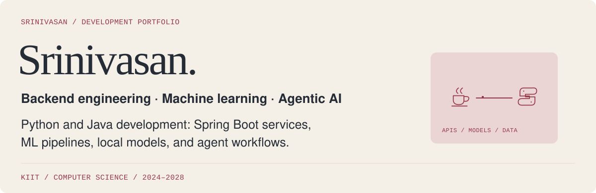
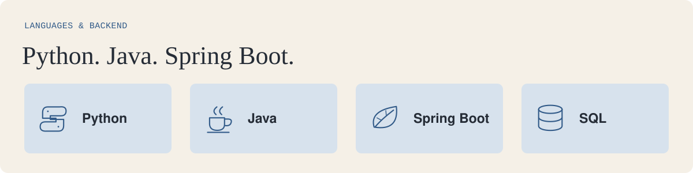
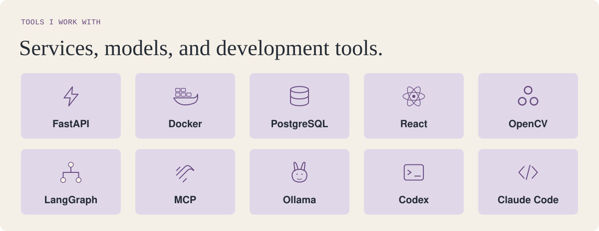
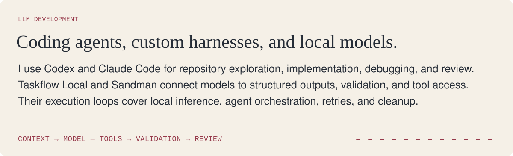
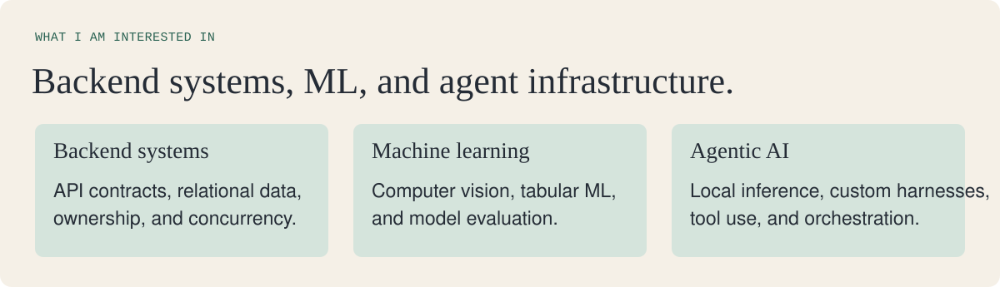
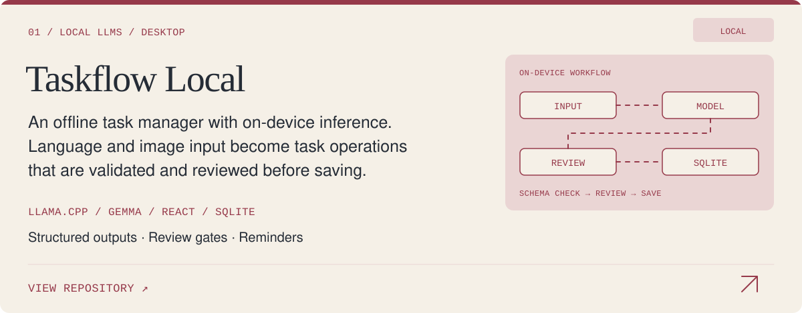
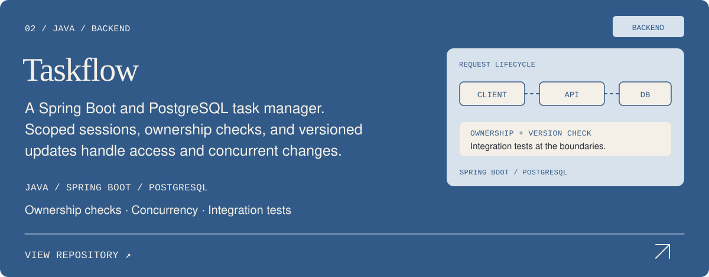
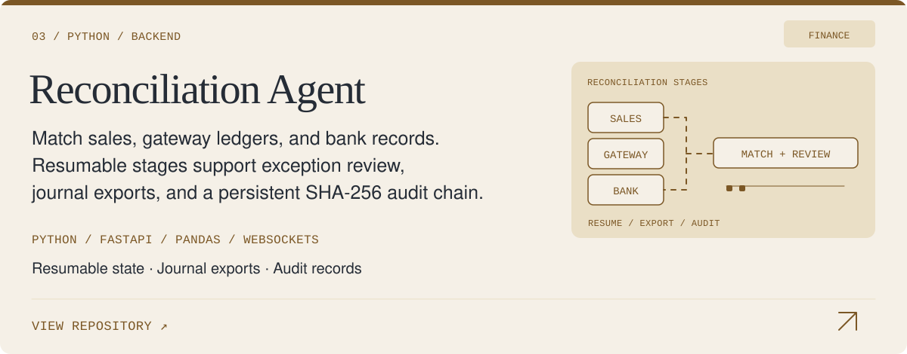
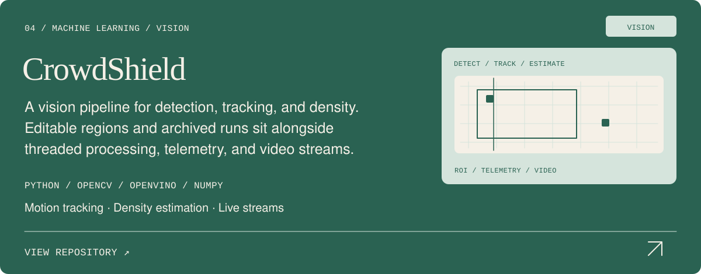
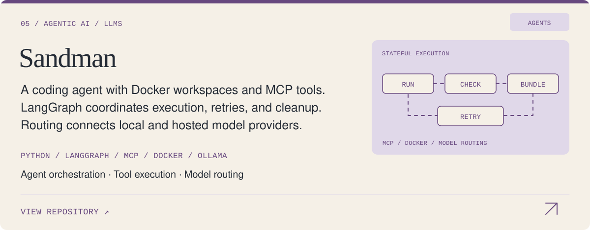

<picture>
  <source media="(max-width: 600px)" srcset="./assets/p5-intro-mobile.svg" />
  
</picture>

<picture>
  <source media="(max-width: 600px)" srcset="./assets/p5-skills-mobile.svg" />
  
</picture>

<picture>
  <source media="(max-width: 600px)" srcset="./assets/p5-tools-mobile.svg" />
  
</picture>

<picture>
  <source media="(max-width: 600px)" srcset="./assets/p5-llm-mobile.svg" />
  
</picture>

<picture>
  <source media="(max-width: 600px)" srcset="./assets/p5-interests-mobile.svg" />
  
</picture>

<a href="https://github.com/S-Srinivasan-06">
<picture>
  <source media="(max-width: 600px)" srcset="./assets/p5-social-github-mobile.svg" />
  
</picture>
</a>

<a href="https://www.linkedin.com/in/s-srinivasan-a69006315/">
<picture>
  <source media="(max-width: 600px)" srcset="./assets/p5-social-linkedin-mobile.svg" />
  
</picture>
</a>

<a href="mailto:srinivasansubr2006@gmail.com">
<picture>
  <source media="(max-width: 600px)" srcset="./assets/p5-social-email-mobile.svg" />
  
</picture>
</a>

<a href="https://leetcode.com/u/aKpXSchpeo/">
<picture>
  <source media="(max-width: 600px)" srcset="./assets/p5-social-leetcode-mobile.svg" />
  
</picture>
</a>

<a href="https://github.com/S-Srinivasan-06/Taskflow-Local-hacktoberfest-weekend"><picture><source media="(max-width: 600px)" srcset="./assets/p5-tab-1-mobile.svg" /></picture></a>
<a href="https://github.com/S-Srinivasan-06/Taskflow"><picture><source media="(max-width: 600px)" srcset="./assets/p5-tab-2-mobile.svg" /></picture></a>
<a href="https://github.com/S-Srinivasan-06/Razorpay-Buildathon-webui-and-cli"><picture><source media="(max-width: 600px)" srcset="./assets/p5-tab-3-mobile.svg" /></picture></a>
<a href="https://github.com/S-Srinivasan-06/CrowdShield"><picture><source media="(max-width: 600px)" srcset="./assets/p5-tab-4-mobile.svg" /></picture></a>
<a href="https://github.com/S-Srinivasan-06/sandman-ai-sandbox"><picture><source media="(max-width: 600px)" srcset="./assets/p5-tab-5-mobile.svg" /></picture></a>

<a href="https://github.com/S-Srinivasan-06/Taskflow-Local-hacktoberfest-weekend">
<picture>
  <source media="(max-width: 600px)" srcset="./assets/p5-local-mobile.svg" />
  
</picture>
</a>

<a href="https://github.com/S-Srinivasan-06/Taskflow">
<picture>
  <source media="(max-width: 600px)" srcset="./assets/p5-backend-mobile.svg" />
  
</picture>
</a>

<a href="https://github.com/S-Srinivasan-06/Razorpay-Buildathon-webui-and-cli">
<picture>
  <source media="(max-width: 600px)" srcset="./assets/p5-finance-mobile.svg" />
  
</picture>
</a>

<a href="https://github.com/S-Srinivasan-06/CrowdShield">
<picture>
  <source media="(max-width: 600px)" srcset="./assets/p5-vision-mobile.svg" />
  
</picture>
</a>

<a href="https://github.com/S-Srinivasan-06/sandman-ai-sandbox">
<picture>
  <source media="(max-width: 600px)" srcset="./assets/p5-agents-mobile.svg" />
  
</picture>
</a>
